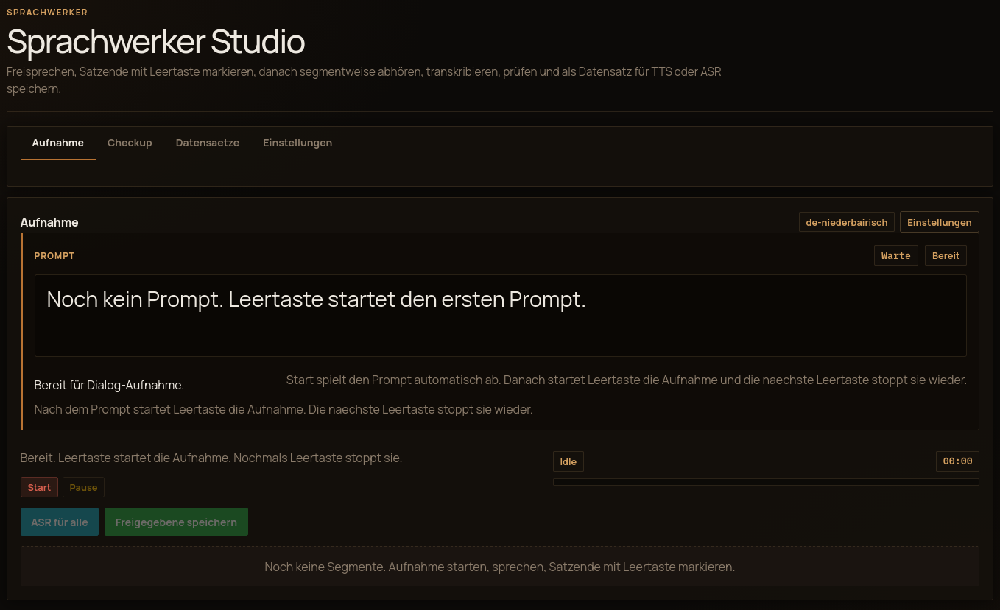

# Sprachwerker Studio

Browser-based recording and review studio for TTS and ASR speech datasets. Built for dialect speakers, emotion-aware voice models, and anyone who needs clean, reviewed training data from spontaneous speech.

Supports German and English UI. Runs fully local — no cloud, no external APIs required.



## What It Does

**Recording**
- Records audio directly in the browser
- Dialog mode: a local LLM (Voxtral) generates a prompt, Piper speaks it aloud, you respond — only your microphone is recorded
- Splits speech into sentence-like segments via the space bar
- Runs local ASR (Voxtral) on each segment

**Free Recording**
- Dedicated tab for uninterrupted free speech — no space bar required
- Record as long as you like, then stop; silence detection automatically splits the audio into segments
- Adjustable minimum silence threshold (default 700 ms)
- Transcribe all segments with one click, review and edit inline, save directly to any dataset profile

**Emotion Recording**
- Kokoro-compatible emotion labels: `neutral`, `happy`, `angry`, `surprised`, `sad`, `whispering`, `question`
- Emotion-actor mode: when a target emotion is set, Piper actively triggers that emotion — tells a bad joke for `happy`, says something provocative for `angry`, whispers a secret for `whispering`, and so on
- Designed to capture natural, authentic emotional reactions rather than acted speech

**Review**
- Manually review, edit, and approve transcripts
- Stores approved items into automatic duration buckets
- Tracks progress toward TTS and ASR collection goals
- Flags duplicate and near-duplicate sentence families

**Dataset Management**
- Named dataset profiles with per-dataset emotion, dialect, and task labels
- Export-ready manifest format (JSON Lines) with full metadata per segment

## Why This Exists

Standard TTS training data tools assume clean studio recordings of read sentences. That fails for:

- **Dialect speakers** — reading written sentences triggers code-switching to standard language
- **Emotion datasets** — acted emotions sound unnatural; prompt-triggered reactions sound real
- **Spontaneous speech** — informal sentence structure, natural pauses, authentic prosody

Sprachwerker solves this by prompting the speaker with a topic or situation, letting them speak freely, then transcribing and reviewing the result.

## Storage Model

Approved data is stored under:

```text
output/_sprachwerker/<language>/<dataset-bucket>/
```

Each saved item produces:

- audio file
- text file
- manifest entry in `_review_manifest.jsonl`

The manifest format is documented in [docs/manifest-schema.md](docs/manifest-schema.md).

## Buckets

Saved segments are automatically routed by audio duration into:

- `-kurz`
- `-mittel`
- `-lang`
- `-sehr-lang`

## Start

Prerequisites:

- Docker with Compose support
- ROCm host or CUDA host, depending on backend

Quickstart:

```bash
cp .env.example .env
```

For ROCm, the defaults in `.env.example` already point to ROCm builder/runtime images.

Start with ROCm:

```bash
docker compose -f docker-compose.yml -f docker-compose.rocm.yml up --build -d
```

Start with CUDA:

```bash
docker compose -f docker-compose.yml -f docker-compose.cuda.yml up --build -d
```

Then open:

- UI: `http://127.0.0.1:8095/`
- Health: `http://127.0.0.1:8095/health`

For a step-by-step first start including verification and troubleshooting, see [docs/first-start.md](docs/first-start.md).

## Automatic Bootstrap

The stack now bootstraps both `llama.cpp` and Voxtral automatically before `asr-api` starts.

Bootstrap services:

- `llama-builder`
- `model-fetcher`

What they do:

- `llama-builder` clones and builds `llama.cpp`
- `model-fetcher` downloads the required Voxtral GGUF files if they are missing

The results are stored in named Docker volumes:

- `llama-bin`
- `llama-src`
- `voxtral-models`

This means the project no longer depends on a prebuilt host `llama.cpp` folder or a manually populated host model folder.

## Backend Selection

Main variables:

- `LLAMA_BACKEND`
- `ASR_BASE_IMAGE`
- `LLAMA_BUILDER_BASE_IMAGE`
- `LLAMA_REPO`
- `LLAMA_REF`
- `LLAMA_FORCE_REBUILD`
- `AMDGPU_TARGETS`
- `CUDA_DOCKER_ARCH`
- `LLAMA_CMAKE_EXTRA_ARGS`

Typical values:

ROCm:

- `LLAMA_BACKEND=rocm`
- `ASR_BASE_IMAGE=rocm/dev-ubuntu-22.04:6.3.4-complete`
- `LLAMA_BUILDER_BASE_IMAGE=rocm/dev-ubuntu-22.04:6.3.4-complete`

CUDA:

- `LLAMA_BACKEND=cuda`
- `ASR_BASE_IMAGE=nvidia/cuda:12.4.1-runtime-ubuntu22.04`
- `LLAMA_BUILDER_BASE_IMAGE=nvidia/cuda:12.4.1-devel-ubuntu22.04`

CPU:

- `LLAMA_BACKEND=cpu`
- `ASR_BASE_IMAGE=ubuntu:22.04`
- `LLAMA_BUILDER_BASE_IMAGE=ubuntu:22.04`

## Voxtral Download

Default model source:

- `bartowski/mistralai_Voxtral-Small-24B-2507-GGUF`
- `mistralai_Voxtral-Small-24B-2507-Q4_K_M.gguf`
- `mmproj-mistralai_Voxtral-Small-24B-2507-f16.gguf`

Relevant variables:

- `HF_TOKEN` optional for public repos, required for gated repos
- `VOXTRAL_HF_REPO`
- `VOXTRAL_MODEL_FILENAME`
- `VOXTRAL_MMPROJ_FILENAME`

Dialog mode variables:

- `PIPER_URL`
- `PIPER_DEFAULT_VOICE`
- `VOXTRAL_TEXT_CLI_PATH`
- `VOXTRAL_PROMPT_MAX_TOKENS`
- `VOXTRAL_PROMPT_TIMEOUT_SECONDS`

The default `docker compose` stack now starts a local Piper service automatically.

It installs `de_DE-thorsten-high` directly inside the Piper image during Docker build, so Sprachwerker no longer depends on an external Piper stack or a host-mounted voices folder.

## Configuration

Important variables:

- `CONTAINER_NAME`
- `PORT`
- `APP_TITLE`
- `DIALECT_NAME`
- `UI_DEFAULT_LANG`
- `SOURCE_LANGUAGE_CODE`
- `APP_REGION_GROUP`
- `SOURCE_TEXT_LABEL`
- `TARGET_TEXT_LABEL`
- `DEFAULT_TASK_MODE`
- `DEFAULT_SPEAKER_PROFILE`
- `DEFAULT_DIALECT_LABEL`
- `DEFAULT_EMOTION_LABEL`
- `TTS_TARGET_HOURS`
- `ASR_TARGET_HOURS`
- `TRANSLATION_ENABLED`
- `OUTPUT_HOST_DIR`
- `REVIEW_SUBDIR`

ASR backend variables are also listed in `.env.example`.

`APP_REGION_GROUP` can be set to `germany` or `other`. If `UI_DEFAULT_LANG` is left empty, the UI language falls back to German for `germany` and English for `other`.

## Manifest Schema

Reviewed dataset items are stored as JSON Lines in `_review_manifest.jsonl`, with one object per approved segment.

- Human-readable field documentation: `docs/manifest-schema.md`
- Machine-readable schema: `schemas/review_manifest.schema.json`

## Additional Docs

- Bootstrap and backend setup: [docs/bootstrap-and-backends.md](docs/bootstrap-and-backends.md)
- First start and live bootstrap checks: [docs/first-start.md](docs/first-start.md)
- Dialog mode and prompt flow: [docs/dialog-mode.md](docs/dialog-mode.md)
- Free recording mode: [docs/free-recording.md](docs/free-recording.md)

## Public Repo Notes

Before publishing or sharing:

- do not commit `output/`
- do not commit private recordings or reviewed datasets
- do not commit local binary blobs unless their redistribution is clearly allowed
- keep model paths and local infrastructure configurable

The repository includes a `.gitignore` for the most obvious local artifacts, but you should still review the worktree before any public push.

## License

GNU Affero General Public License v3 — see [`LICENSE`](LICENSE).

If you run a modified version as a network service, you must make the source available to users of that service (AGPL §13).
